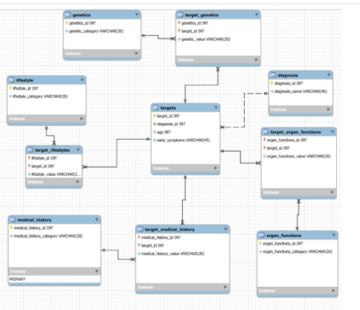

 <h1>🩺 Diabetes Database</h1>

The creation process of a functional database from a real-world health dataset. This project documents the design and development of a scalable relational database schema consisting of 10 entities used to analyze patient information, including lifestyle factors, genetic information, medical records, and organ function data.  

The goal of this project was to apply database design principles and techniques, normalization techniques, and SQL querying skills to create an efficient schema capable of storing healthcare data while supporting meaningful analysis and reporting.
    

     

<h2>🎯 Project Objectives</h2>
<ul>
 <li>Create entities in alignment of the columns in dataset</li>
 <li>Design a logical schema and ERD</li>
 <li>Implement a database that contains data from the dataset</li>
 <li>Develop queries that show research and database capabilities</li>
 <li>Document design process from multiple design iterations</li>
</ul>
 

<h2>🛠️ Design Process</h2>
<ol>
 <li>Initial proposal and entity identification</li>
 <li></li>Logical schema development</li>
 <li>Normalization of schema to reduce redundancy, prevent anomalies, and maintain integrity</li>
 <li>ERD creation</li>
 <li>Physical database development</li>
 <li>Query/View development</li>
 <li>Refining and Testing database</li>
</ol>
 

<h2>🧠 Skills Demonstrated</h2>
<ol>
 <li>SQL/MySQL Workbench</li>
 <li>Database Design</li>
 <li>Data Analysis</li>
 <li>Schema Development</li>
 <li>Database Normalization</li>
 <li>Data Cleaning</li>
 <li>Spreadsheets</li>
 <li>Data Management</li>
 <li>Technical Writing</li>
</ol>

<h2>📁 Repository Structure</h2>

<ul>
  <li>
    <strong>Project Proposal INST327.pdf</strong>
  <ul>
    <li>
Proposal report describing the diabetes dataset, intended research purposes, target audience, initial entity design, and ethical considerations.
    </li>
  </ul>
  </li>
   <li>
      <strong>Diabetes Database Progress Report.pdf</strong>
  <ul>
    <li>
      Progress report presenting the first schema iteration, an Entity Relationship Diagram (ERD), sample data, design changes from the proposal, project progress, ethical considerations, and plans for future development.
    </li>
  </ul>
  </li>
<li>
      <strong>Diabetes Database Final Report.pdf</strong>
  <ul>
    <li>
      Final report of the final database and schema, that includes the physical database, shows sample data of the actual database, an explanation of the queries of views within the database, changes from the last database/report, ethical considerations, and project conclusions. Explains and analyzes our final iteration of the database.
    </li>
  </ul>
  </li>
  <li>
      <strong>team_3_diabetes_backup.sql</strong>
  <ul>
    <li>
      This plain-text file is a backup of the database's structure, data, and settings used to restore/create the database. Contains SQL statements to rebuild the database and populate it from scratch.
    </li>
  </ul>
  </li>
 <li>
      <strong>team_3_diabetes_logical.mwb</strong>
  <ul>
    <li>
      This file is to display the Enhanced-Entity Relationship Model, which shows entitites with their different keys, and views within the database and their relationship to one another. 
    </li>
  </ul>
  </li>
  <li>
      <strong>team_3_diabetes_queries.sql</strong>
  <ul>
    <li>
      This file contains all the queries for different views and their explained purposes inside of the database.
    </li>
  </ul>
  </li>
  <li>
      <strong>README_images</strong>
  <ul>
    <li>
      This folder contains all of the images (4 images) used in this README.
    </li>
  </ul>
  </li>
  <li>
      <strong>diabetes_dataset.xlsx</strong>
  <ul>
    <li>
      This Microsoft Excel Spreadsheets file shows the original dataset, and also the final cleaned dataset that's used in the database as well. It also shows all of the other sheets that were used to downlaod and import into the actual MySQL database.
    </li>
  </ul>
  </li>
</ul>
 

<h2>🗄️ Database Structure</h2>

Entites within the database include:

<ul>
 <li><b>diagnosis</b> --> Different types of diagnoses</li>
 <li>genetics --> Different genetics tests</li>
 <li>lifestyle --> Different lifestyle factors</li>
 <li>medical history --> Different medical tests</li>
 <li>organ functions --> Different organ functionality tests</li>
 <li>targets genetics --> Genetic test results of different targets</li>
 <li>targets lifestyle --> Lifestyle factors of different targets</li>
 <li>targets_medical_history --> Medical test results of different targets</li>
 <li>targets_organ_functions --> Organ function tests results of different targets</li>
 <li>targets --> IDs of different targets (patients)</li>
</ul>

The diabetes database contains ten tables with targets being the main table. The targets table has a one to many relationship with four other tables; the target_genetics, target_organ_functions, target_lifestyles, and target_medical_history tables. These four tables are all linking tables, and have a many to one relationship with its corresponding tables; genetics, organ_functions, lifestyle, and medical_history tables. This means that the targets table has a many to many relationship with genetics, organ_functions, lifestyle, and medical_history. The final table, diagnosis, has a one to many relationship with targets, as many targets can share the same diagnosis.

 

<h2>🔍 SQL Sample Queries</h2>

(First 15 rows)

<ul>
 <li>Example Query 1: Targets older than the average age of their diagnosis group 
<pre> 
SELECT t.target_id, t.age, d.diagnosis_name
FROM targets t
JOIN diagnosis d ON t.diagnosis_id = d.diagnosis_id
WHERE t.age > (
    SELECT AVG(t2.age)
    FROM targets t2
    WHERE t2.diagnosis_id = t.diagnosis_id
);
</pre>

 </li>
 
 <li>Example Query 2: Count of positive genetic testing results per diagnosis 
 <pre> 
 SELECT d.diagnosis_name, COUNT(t.target_id) AS positive_test_count
FROM targets t
JOIN diagnosis d ON t.diagnosis_id = d.diagnosis_id
JOIN target_genetics tg ON t.target_id = tg.target_id
WHERE tg.genetics_id = 4 AND tg.genetic_value = 'Positive'
GROUP BY d.diagnosis_name;
 </pre>
  
 </li>
 
<li>Example Query 3: Count of targets per diagnosis with average age 
<pre>
 SELECT d.diagnosis_name, COUNT(t.target_id) AS target_count, 
       AVG(t.age) AS avg_age
FROM diagnosis d
JOIN targets t ON d.diagnosis_id = t.diagnosis_id
GROUP BY d.diagnosis_name;
</pre>

</li>
</ul>

Within the team_3_diabetes_queries.sql file, there are <b>3</b> other sample queries.

<h2>📋 How to Access the Database/Entity Relationship Diagram</h2>
<ol>
  <li><strong>Install MySQl Workbench</strong></li>
  <li><strong>Download team_3_diabetes_backup.sql and team_3_diabetes_logical.mwb Files</strong></li>
  <li><strong>Open team_3_diabetes_backup.sql on files</strong>
    <ul>
     <li>
      Choose to open on MySQL Workbench
     </li>
    </ul>
  </li>
   <li><strong>Run the Query Tab of the Backup</strong>
    <ul>
     <li>
      After running the query tab, refresh schemas which loads the schema for the database and its data and views.
     </li>
    </ul>
  </li>
 <li>Open team_3_diabetes_logical.mwb on files
  <ul>
   <li>
    Automatically opens and preents the Entity Relationship Diagram on MySQL Workbench
   </li>
  </ul>
 </li>
</ol>

